## Line following Car
It is a device which follows path drawn on floor using some sensors.

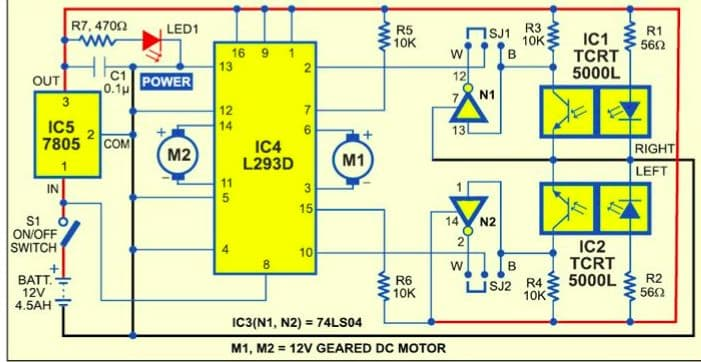

Here, key stuff we use are two reflective optical sensors, inverter, motor driver, regulator.

Reflective optical sensors are used to find path. Here, path is defined by either black strip on white floor or white strip on black floor. These sensors consist of photo-transistor and an IR emitter. Depending on intensity captured the direction is decided.

Inverters is used when we use a white track on a black floor to convert it to signal equivalent to that in case of black track on a white floor. 

Motor driver is used to send signal to respective motors according to the signal recieved from sensor. 

Regulator is used to control voltage flow from source 

## Cell phone Detector 
It is a device which detects any activated phone is present nearby. This device generally tries to detect RF signals released by phone.

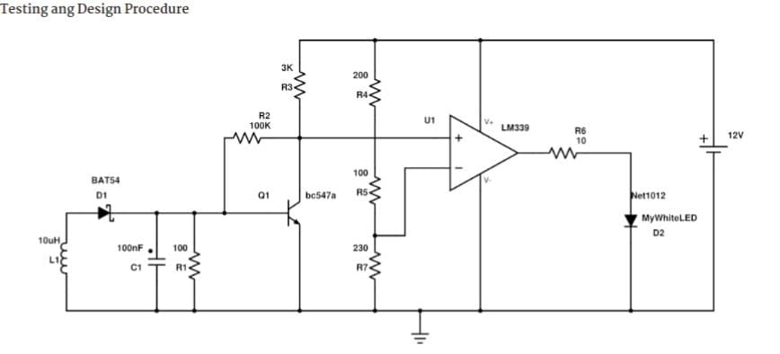

Here, key stuff we use are Schottky Diode, Inductor, Comparator

Generally, cell phones transmits and receives a RF signal which are in a range of 0.9 to 3 GHz. These signals can induce inductor which we can rectify by schottky diode and filter by a capacitor. This signal can be amplified by transistor.

Comparator is used to compare between two voltages. Here we accordingly set reference voltage on inverting end. When output voltage is less than voltage at inverting end, its low logic signal. and high logic otherwise.

And we can set an LED to the output logic by comparator thus making LED glow when any cell phone is nearby.

## Visitor Counter
It is a device which detects how many people went in and out of a room

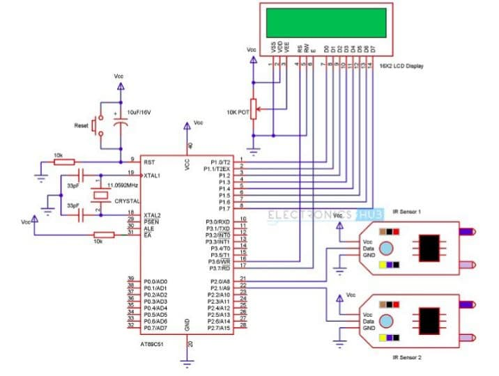

Here, key stuff we use are two IR sensors, display, microcontroller

We use IR sensor one at entry and other at exit of gate. 

We connect IRs and display to microcontroller and program it accordingly such that when an object passes from both the IRs into the room, we increase number of people in a room by one and if an object passes from both the IRs out of the room, we decrease number of people in a room by one.

## Solar Battery Charger
It is a device used to charge a battery using solar power

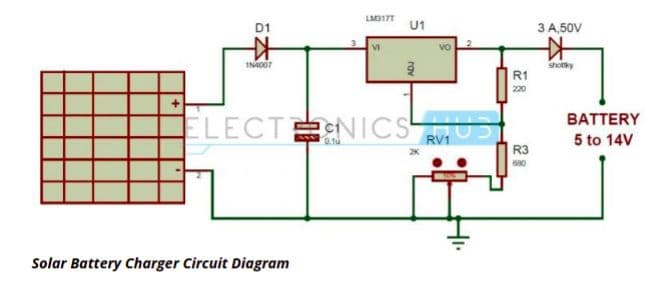

Here, key stuff we use are Solar Panel, Voltage Regulator, Schottky Diode, Diode.

Solar Panel provides constant current when sunlight falls on it.

Voltage regulator can be adjusted such that we can get required voltage for charging battery. Schottky Diode is used to protect panel and regulator from reverse voltage produced by battery while it is not charging and diode to protect it from reverse polarity.

## FM Bugger 
It is a device used to listen conversation from a distance using fm radio as receiver.

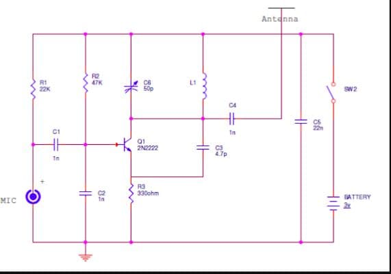

Here, key stuff we use are mic, few capacitors and inductor

We transmit signal from mic to reciever by frequrncy modulation which can be detected by fm receiver by setting it at a particular frequency. We first remove noise by using capacitors and later turn it into a carrrier signal using an inductor and capacitor. This capacitor can be adjusted accordingly thus setting frequency at receiver. We amplify signal using transistor and transmit it using antenna.

## Water level indicator
It is a circuit which shows water level in a container

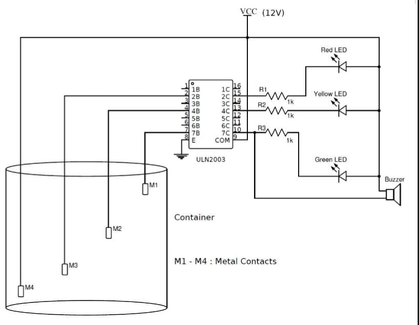

Here, key stuff we use are ULN2003, metal contacts, buzzer

As water is good conductor of electricity, we can use this property and make a level indicator. We keep metal contact connected to high at bottom of tank and other at levels where we want to get to notify. When water gets filled to certain level current flows from plate connected to high through water to plate connected to ULN2003 which has 7 pairs of Darlington transistor

For the final contact connected, output is connected to a buzzer along with LED in parallel.

## Battery Level Indicator
It is a device used to find charge present in a battery

Here, key stuff we use are LM3914 IC, LEDs, Potentiometer.

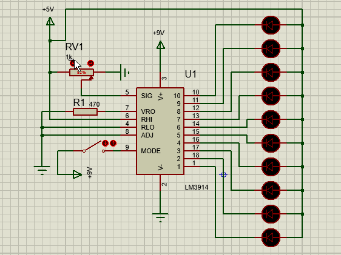

LM3914 IC is a LED dot/bar display driver. It takes input analog voltage and makes LEDs glow according to input voltage. Here, we set reference voltage levels (High, Low) using resistors and these resistors are decided by adjusting potentiometer and few resistors. Later on circuit is build accordingly and can be used for testing. There exists some error due extra resistance by cables etc,.

## Magnetic Leviation 
It is a project where we can suspend magnet in air

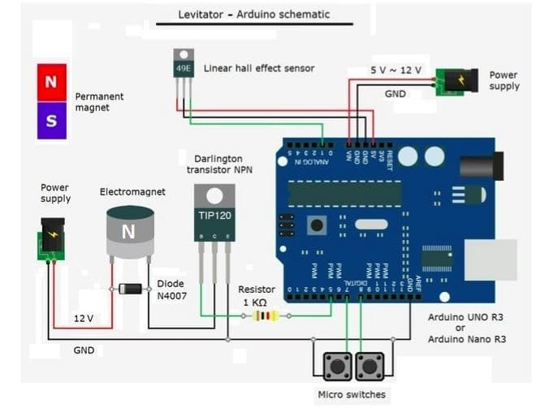

Here, key stuff we use are electromagnet, Hall Effect Sensor, Arduino and two push buttons

We try to suspend magnet using attraction from above. We keep an electro magnet, Hall effect sensor at a distance of 5mm facing down ward on top. We adjust the position of electro magnet using switches, Thus making it balance in a position. 

But we find that it starts oscillating after some time this is due to lorentz force at the top, this can be avoided by keeping a damping plate made of diamagnetic material at bottom.

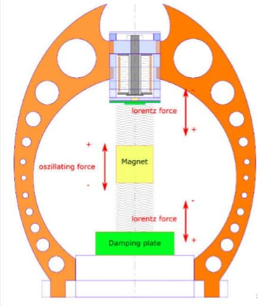

## Security using RFID reader
It is a circuit which transmits radio frequencies and later reads the frequency emitted by the RFID card/tag.

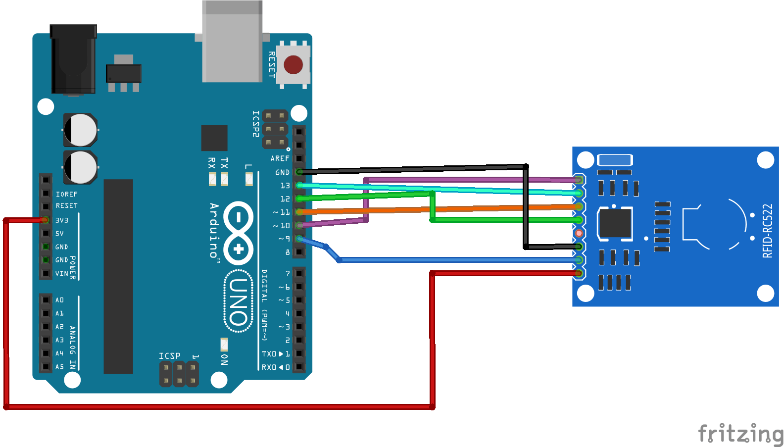

Here, key stuff we use are Arduino, RFID reader, Servo/anything (which operates on access)

Generally, every RFID tag has a unique ID on it which is a 8-digit hexadecimal number. We take its ID in prior and code Arduino accordingly. Whenever RFID reader reads it, we make some unlocking procedure run when its a correct UID.

## Remote Control System for Doors and LEDs
It is a circuit connected to Arduino which is communicated via Android app using bluetooth

Here, key stuff we use are Arduino, Servo motor, Bluetooth module

The important stuff in this project is programming a android app and coding arduino. Android app is made using Android Studio or some other related app using java/Kotlin language. We set bluetooth connectivity and few trigger signals using the app and make arduino respond. Arduino is kept active and programmed in such that it connects to any android phone with its bluetooth on but receive signal only through the app designed. Thus when command is given through the app it acts accordingly (turns servo thus opening door or turn on LED)

## Arduino Environmental Monitoring
It is a device which senses environment details like humidity, temp etc and uploading in cloud.

Here, key stuff we use are Arduino, MikroE Environment click, WiFi driver

We collect data from MikroE Environmental click and store it in flash storage. Arduino is connected to WiFi using WiFi driver and made send it to cloud using some IoT platform like WolkAbout where we create a device id and password for our arduino and send data using WiFi using libraries. Now, we can access data from any device using their application and few changes.

## Burglar alerting system
It is a circuit which alerts when a person enters using LDR.

Here, key stuff we use are LDR, Regulator, Diode, Transistor

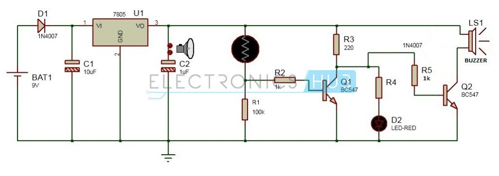

LDR as name says it is a light dependent resistor. It has high resistance in dark and low resistance in light. 

Regulator is used to control voltage in the circuit. Diode is used to prevent reverse current in circuit. Here, we want either alarm or some alerting system respond when a person enters (i.e. shadow falls). It means when current reduces alert system should be active, so we use transistor to achieve this task.

## TV remote controlled Home appliances
It is a circuit which can enable or disable power supply to a home appliance using tv remote

Here, key stuff we use are IR reciever, Micro controller, Relay, Transistor

Generally, a TV remote signal is an IR signal which has different frequency for different button and system. We use this difference and make different remote work with their respected devices. Thus first we find out the frequency of light sent by our IR remote. Later noting the IR frequencies we build a code for our microcontroller which controls the power to few appliances by different inputs present in a remote. We use relay to activate and deactivate according to the signal sent by microcontroller. Transistor is use to amplify the signal.

## Car Parking sensor
It is a device which would make sound if car is getting near to end or wall backside

Here, key stuff we use are Ultrasonic Sensor, Arduino and Buzzer

Generally, we see many cars get hit by back wall while parking due to lack of proper sight in that region. To avoid it, we can use an Ultrasonic sensor on the wall of the parking place. We connect it to an arduino and measure the distance between car and wall and ring the buzzer when distance is less.

## Measuring CO2 concentration in Air
It is a Device which measures amount of CO2 present in air.

Here, Key stuff we use are Arduino, MQ-135 Sensor, OLED display

Here MQ-135 Gas Sensor is an air quality sensor used for detecting wide range of gases. Gas which it detects depends on the load resistor of it. Generally, The inbuilt value of it can be in the range of 10Kohm to 47Kohm. For CO2, the value is 22Kohm. 

We code arduino using MQ135 library, for finding R0 (which is needed).
Then we heat the circuit for 24 hrs and find value of resistance R0. Later, we go to the master folder and change Rload, Rzero values accordingly. We also change the values of AtmoCO2 to present value. Now, we are all set. We can use it for measuring CO2 and display it in OLED display.

